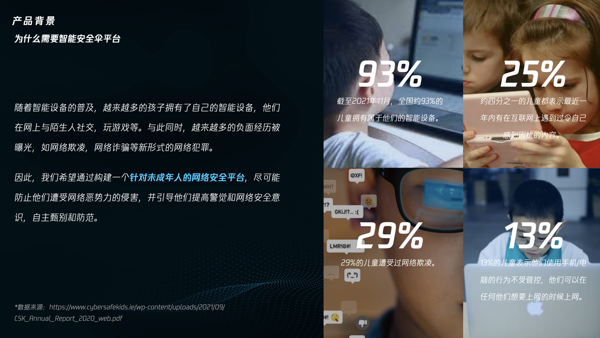
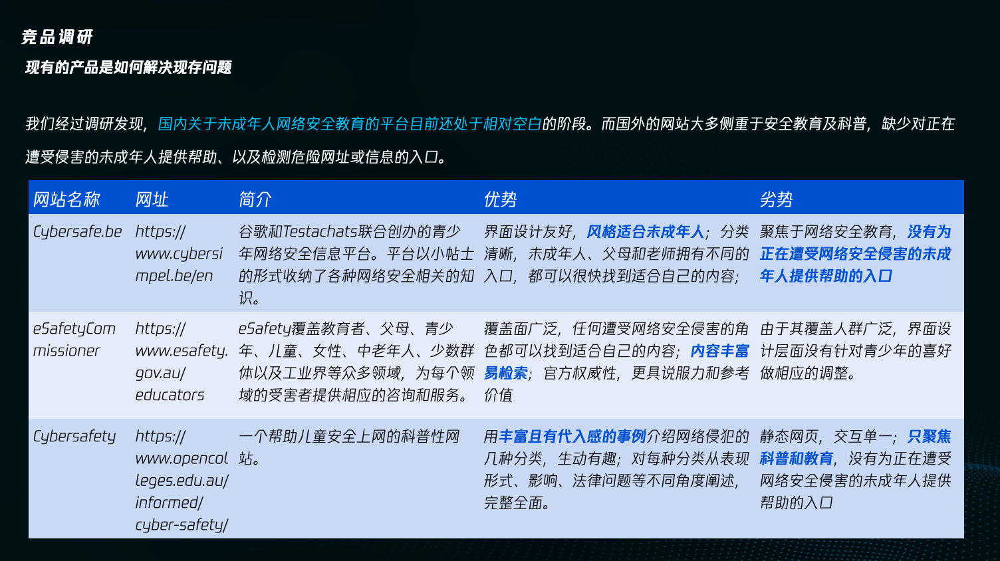
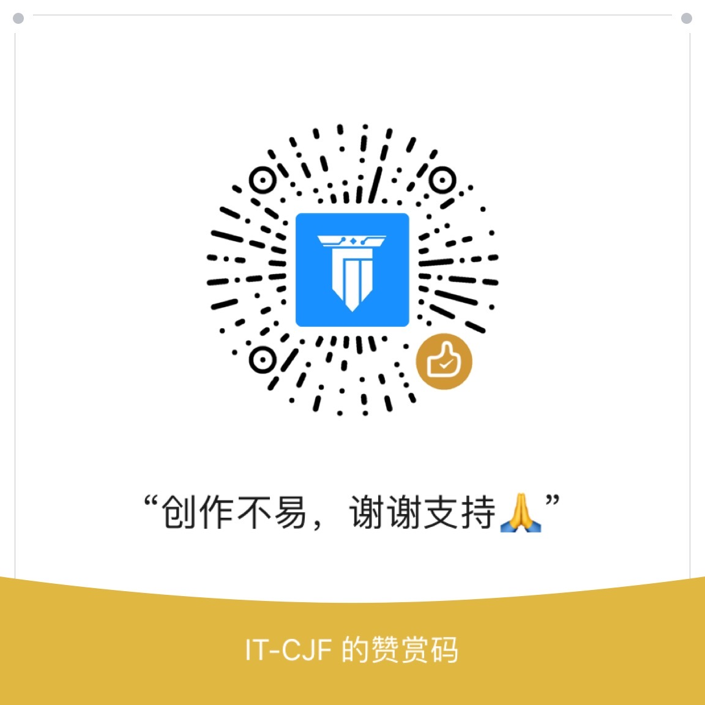

# safeumbrella 智能安全伞平台云
<p align="center">
    
</p>

<!-- ALL-CONTRIBUTORS-BADGE:START - Do not remove or modify this section -->
[](#contributors-)
<!-- ALL-CONTRIBUTORS-BADGE:END -->


## 项目介绍
>  本项目基于腾讯云低代码平台开发，从青少年网络安全的保护和教育两方面入手，利用腾讯大数据，集成腾讯云AI的自然语言处理（NLP）和AI内容安全平台进行关键词提取，通过对文本内容进行深度分析，实现网址风险评估， 搜索结果过滤，扫码安全提醒，智能识别短信诈骗，从外部有效地减少青少年在日常生活中可能受到的网络侵害；同时整合了国内外优质的网络安全学习资源和原创资源，以公益、免费的形式推广，来帮助青少年用户及家长们形成健康的网络安全意识。

>  另外， 我们创造性地提出了保护与教育相结合，来解决网络欺凌的方案， 即用户在发送消息之前不能确定是否会对聊天对方产生影响时，小安可以通过腾讯云的自然语言处理（NLP）接口分析预发送消息的情感倾向（积极或是消极），给予用户一定的正向引导，让“说出口的话”少些戾气，让AI更有温度！

## 产品简介


## 产品背景


## 愿景和使命


## 竞品调研


## 快速上手
环境要求：Node.js >= 14
安装依赖：
```bash
yarn
```

## 安装 CloudBase CLI#
```bash
使用 NPM
npm i -g @cloudbase/cli
或使用 Yarn
yarn global add @cloudbase/cli
```

## tcb常用命令
cloudbase login

## 添加新函数
cloudbaserc.json add function
```json
 {
      "name": "textModeration",
      "timeout": 5,
      "envVariables": {},
      "runtime": "Nodejs12.16",
      "memorySize": 256,
      "handler": "index.main"
  }
```

```bash
- 登录云开发环境
cloudbase login

– 部署云函数
tcb fn deploy textModeration 

- 下载云函数代码
tcb fn code download textModeration

- 代码更新
tcb fn code update nlpSentimentAnalysis
tcb fn deploy textModeration

```

## 欢迎贡献
项目需要大家的支持，期待更多小伙伴的贡献，你可以：
- 提建议或 Bug：[反馈平台](https://support.qq.com/products/383145)
- 在 GitHub 上提交你的项目

## 联系作者


## 公益捐赠


## 致谢
蔡俊锋 王梓澔 田家明 欧阳婷婷

## Contributors ✨
Thanks goes to these wonderful people ([emoji key](https://allcontributors.org/docs/en/emoji-key)):
<!-- ALL-CONTRIBUTORS-LIST:START - Do not remove or modify this section -->
<!-- prettier-ignore-start -->
<!-- markdownlint-disable -->
<table>
  <tr>
    <td align="center"><a href="https://blog.csdn.net/caijunfen"><br /><sub><b>腾讯全栈开发  IT-CJF</b></sub></a><br /><a href="https://github.com/liyupi/code-nav/commits?author=jwcjf" title="Code">💻</a></td>
   
  </tr>
</table>